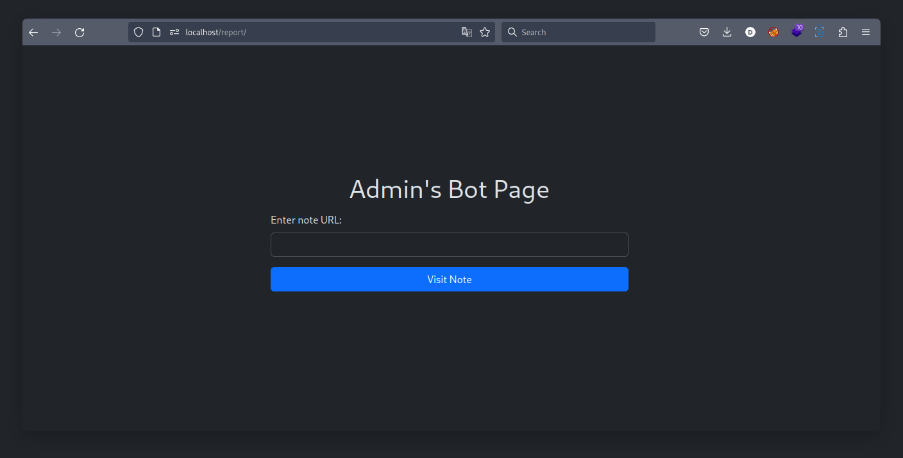
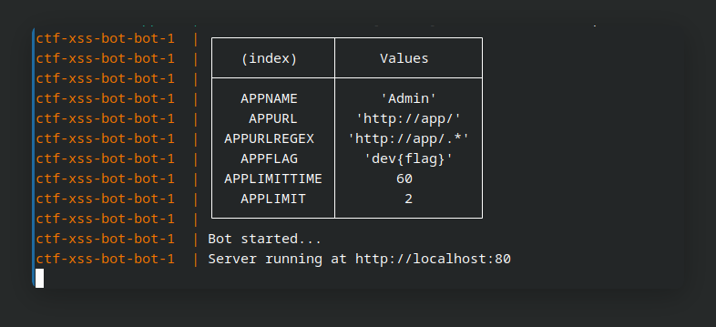

# CTF-XSS-BOT



CTF-XSS-BOT is a flexible template designed for crafting Cross-Site Scripting
(XSS) challenges in Capture The Flag (CTF) competitions. This project provides a
foundation for effortlessly setting up an environment to host XSS challenges,
while utilizing Puppeteer to simulate web browser behavior.

## Features

- **Customize APP Name:** Easily set a custom application name to match your challenge theme.
- **White List URL By Regex:** Define a regex pattern to whitelist specific URLs for challenge interaction.
- **Rate Limiting:** Prevent abuse with built-in rate limiting to control participant interactions.
- **Automated Browser Extension Installation:** Automatically install the browser extension.

## Usage

1. Clone this repository:
   ```sh
   git clone https://github.com/dimasma0305/CTF-XSS-BOT.git
   cd CTF-XSS-BOT
   ```

2. Customize the source code of your challenge at `./src/*`.

3. Configure the parameters in `docker-compose.yaml`:
   ```yaml
   ...snip...
    environment:
        APPNAME: YourAppName
        APPURL: YourAppURL
        APPURLREGEX: YourAppURLRegex
        APPFLAG: dev{flag}
        APPLIMIT: 2
        APPLIMITTIME: 60
    ...snip...
   ```

4. Deploy the template using Docker Compose:
   ```sh
   docker-compose up -d
   ```
   

5. Your `./src` will be hosted at http://localhost/, and the bot can be accessed
   at http://localhost/report. Customize your XSS challenges and empower participants to master web security.

6. If you want to add a browser extension, you can add a extension folder in `./bot/extensions`, the extension will be automatically installed when the bot is started.
